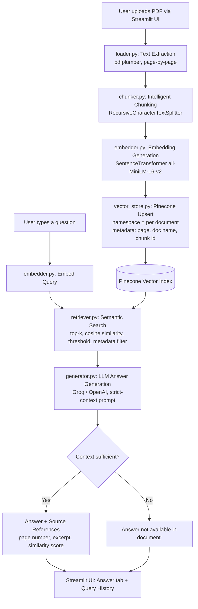

# System Architecture Diagram

Paste the Mermaid block below into [mermaid.live](https://mermaid.live) or a
Markdown viewer that supports Mermaid (GitHub does) to render it, or export
it as a PNG for your submission.

## Module responsibility map

| File | Responsibility |
|---|---|
| `app.py` | Streamlit UI orchestration only — no business logic |
| `config.py` | Environment variable loading & validation |
| `src/loader.py` | PDF → cleaned, page-tagged text |
| `src/chunker.py` | Page text → overlapping chunks with stable IDs |
| `src/embedder.py` | Text → embedding vectors (cached model) |
| `src/vector_store.py` | All Pinecone calls: index creation, upsert, query, namespace/metadata mgmt |
| `src/retriever.py` | Query embedding + Pinecone query orchestration, thresholding |
| `src/generator.py` | Strict-context LLM prompting, hallucination guardrail, confidence scoring |
| `src/utils.py` | Query logging (CSV), text truncation, namespace sanitising |
